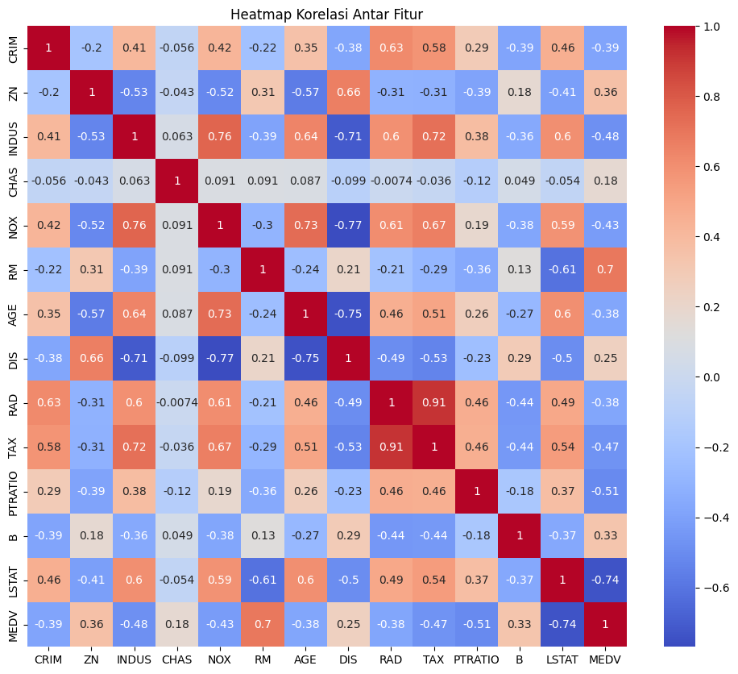
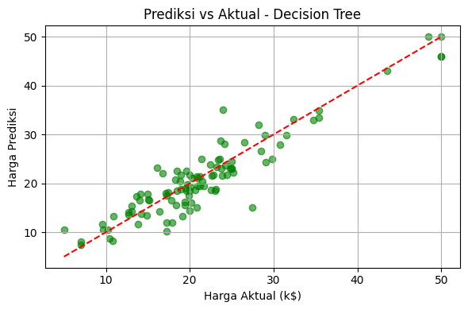

# 🏡 Prediksi Harga Rumah Boston

Proyek ini bertujuan untuk membangun model prediksi harga rumah di kota Boston menggunakan algoritma **Decision Tree Regressor**, serta mengevaluasi performanya berdasarkan berbagai metrik dan visualisasi.

# Deskripsi Proyek
Proyek ini bertujuan untuk memprediksi harga rumah di wilayah Boston menggunakan model Decision Tree Regressor. Dataset yang digunakan
adalah Boston Housing dan target prediksinya adalah MEDV (Median value of owner-occupied homes dalam ribuan dolar).

## Dataset

Dataset yang digunakan adalah **Boston Housing Dataset** dari Kaggle :

📁  [/content/boston.csv](https://www.kaggle.com/datasets/vivek468/superstore-dataset-final)

| Kolom    | Deskripsi                                                  |
| -------- | ---------------------------------------------------------- |
| CRIM     | Per capita crime rate by town                              |
| ZN       | Proporsi lahan pemukiman untuk rumah >25,000 sq.ft.        |
| INDUS    | Proporsi lahan untuk bisnis non-retail                     |
| CHAS     | Dummy variable (1 jika berbatasan dengan sungai Charles)   |
| NOX      | Konsentrasi nitrogen oksida                                |
| RM       | Rata-rata jumlah kamar per hunian                          |
| AGE      | Proporsi rumah yang dibangun sebelum 1940                  |
| DIS      | Jarak ke pusat kerja                                       |
| RAD      | Indeks aksesibilitas ke jalan raya                         |
| TAX      | Pajak properti                                             |
| PTRATIO  | Rasio murid-guru di kota                                   |
| B        | 1000(Bk - 0.63)^2 (dimana Bk = proporsi orang kulit hitam) |
| LSTAT    | Persentase status sosial ekonomi rendah                    |
| **MEDV** | Median value rumah dalam ribuan dolar (k$)                 |

## Library yang Digunakan

```python
import numpy as np
import pandas as pd
import matplotlib.pyplot as plt
import seaborn as sns
from sklearn.model_selection import train_test_split
from sklearn.tree import DecisionTreeRegressor
from sklearn.metrics import r2_score
```

## Eksplorasi Data
🔍 Struktur Data
Dataset memiliki 14 kolom, dimana:
- Fitur numerik seperti `RM` (jumlah kamar), `LSTAT` (persentase masyarakat berstatus sosial rendah), `TAX`, `NOX`, dll.
- Target: `MEDV` (harga rumah dalam k$)

## Visualisasi Korelasi Antar Fitur
Visualisasi heatmap digunakan untuk melihat hubungan antar fitur dan dengan target `MEDV`.
<p align="center">
  <br>
</p>

**Insight dari Heatmap:**

| Fitur     | Korelasi dengan MEDV | Interpretasi                                                |
| --------- | -------------------- | ----------------------------------------------------------- |
| `RM`      | **+0.70**            | Semakin banyak kamar, harga rumah meningkat                 |
| `LSTAT`   | **-0.74**            | Semakin tinggi persentase status sosial rendah, harga turun |
| `PTRATIO` | -0.51                | Rasio murid-guru tinggi → harga lebih rendah                |
| `INDUS`   | -0.48                | Daerah industri berlebih menurunkan harga rumah             |
| `TAX`     | -0.47                | Pajak properti tinggi → harga rumah cenderung turun         |
| `NOX`     | -0.43                | Polusi tinggi (NOX) → harga rumah lebih rendah              |

Terdapat multikolinearitas:

Beberapa fitur berkorelasi erat satu sama lain, seperti:
- `RAD` vs `TAX` = 0.91
- `NOX` vs `INDUS` = 0.76
- `NOX` vs `DIS` = -0.77

## Training dan Evaluasi Model
- Training model menggunakan Decision Tree Regressor.
- Evaluasi Model, menghasilkan
  R² Score: 0.696
  Artinya model *Decision Tree* cukup menjelaskan sekitar 69.6% variasi harga rumah (MEDV) berdasarkan fitur-fitur inputnya (seperti `RM`, `LSTAT`, `AGE`, dll).

## Visualisasi: Prediksi vs Aktual
Berikut adalah scatter plot antara harga rumah aktual dan hasil prediksi dari model Decision Tree Regressor:



- Titik-titik hijau: hasil prediksi vs harga rumah aktual.
- Garis merah menunjukkan prediksi sempurna `(prediksi = aktual)`.
- Sebagian besar prediksi cukup dekat dengan nilai sebenarnya.
- Model mengikuti pola umum dengan cukup baik, meskipun masih ada deviasi/outlier.

Model menghasilkan **R² Score sebesar 0.696**, menunjukkan bahwa sekitar 69.6% variasi harga rumah dapat dijelaskan oleh model.


